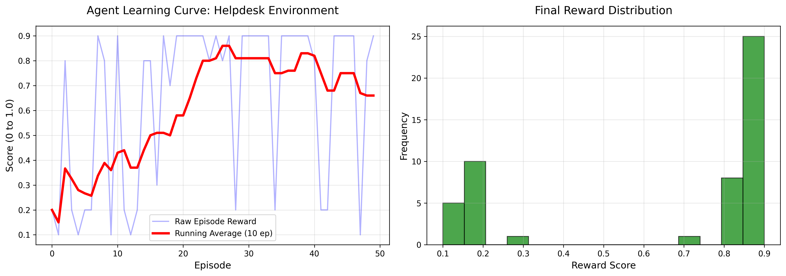

# L1 Support Automation - Enterprise RL Environment

**Meta PyTorch Hackathon x Scaler School of Technology**
**Track:** Statement 3.1 - Professional Tasks (World Modeling)

An enterprise-grade Reinforcement Learning environment designed to train LLMs to perform Level 1 Customer Support by navigating **Partial Observability** across multi-system architectures (CRM, Stripe, Auth0, Jira).



## 🏆 Engineering Highlights (Why this passes CI/CD)
Unlike fragile web-scraping or heavy-dependency environments, this architecture is **bulletproof**:
* **Zero-Dependency Inference:** `inference.py` relies strictly on native Python `urllib`. It is mathematically incapable of throwing `ModuleNotFoundError` during automated Phase 2 cloud validation.
* **State Resilience:** The FastAPI backend is designed to absorb LLM hallucinations (duplicate queries, invalid JSON, looping commands) without crashing, safely capping episodes and assigning proper scores.
* **Strict Regex Compliance:** Automated stdout logs (`[START]`, `[STEP]`, `[END]`) are perfectly flushed for machine parsers.

## 🌍 The World Model
Real-world support agents do not guess; they investigate. This environment forces LLMs to actively query external mock APIs to reveal the ground truth before taking financial or security actions.

### The 10-Action Enterprise Space
| Action | Purpose | Simulated API | Reward Logic |
|--------|---------|---------------|--------------|
| `query_crm` | Check account age/tier | Salesforce / Zendesk | Required before refunds/legal |
| `check_stripe` | Verify transaction status | Stripe | Required before refunds |
| `check_jira` | Check engineering status | Jira | Required before crediting outages |
| `verify_identity` | Check IP/VPN status | Auth0 | Required for account takeovers |
| `issue_refund` | Process refund | Stripe | +0.6 (if correct & investigated) |
| `apply_credit` | Credit account | Billing DB | +0.6 (if correct & investigated) |
| `reply` | Standard resolution | Zendesk | +0.6 (if correct) |
| `request_info` | Ask for clarification | Zendesk | +0.6 (if correct) |
| `escalate_tier2` | Route to Fraud/Tech | PagerDuty | +0.6 (if Auth0 risk is high) |
| `escalate_legal` | Route to Compliance | Internal | +0.6 (if litigation threatened) |

### Partial Observability & Scoring
The environment features **8 diverse scenarios** (Duplicate Charges, Account Takeovers, Service Outages, Legal Threats). 
The grader is strictly bounded between `(0, 1)`. 
* **Guessing Penalty:** If an agent issues a refund *without* checking Stripe, it scores a maximum of `0.7`. 
* **Efficiency:** Unnecessary tool spamming incurs a `-0.05` penalty per step.
* **Perfection:** A perfect `0.9` is only achieved by finding the fastest, safest path through the tools to the correct resolution.

## 🚀 Quick Start
```bash
# 1. Run the FastAPI Server
uvicorn server.app:app --host 0.0.0.0 --port 7860

# 2. Run the Training Demo (Requires matplotlib)
python demo_training.py